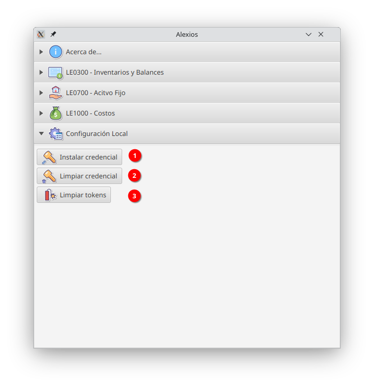

# The Alexios Project

v1.0

Copyleft 2021 - Lima Perú.

## What is Alexios?

Alexios es una aplicación de ayuda para generar los archivos TXT requeridos por la SUNAT,
la autoridad tributaria del Perú.

El usuario debe crear una hoja de Google Spreadsheet conteniendo la información
requerida, y usando Alexios puede crear el archivo de texto plano, separado por
el caracter pipe (|).

## ¿Qué NO es Alexios?

Aloexios NO es un ERP, ni un software contable. Tampoco valida la información,
solamente transforma datos desde un format amigable al formato TXT especificado
por el Programa de Libros Electrónicos SUNAT (PLE - SUNAT) v5.1.

## Libros Implementados

El programa Alexios contiene interfaces que deben ser implementadas. Esas
interfaces corresponden a cada libro especificado por el PLE.

Actualmente, los libros implementados son:

- LE030000 -> Inventarios y balances.
- LE070000 -> Activo Fijo.
- LE100000 -> Registro de Costos.

# ¿Cómo usar Alexios?

1. Obten un archivo credentials.json de tipo Oauth ClientID de Google Cloud Platform,
con permisos para los ámbitos: ``https://www.googleapis.com/auth/spreadsheets.readonly`` 
y ``https://www.googleapis.com/auth/drive.readonly``, si no sabes
cómo crear una credencial de Google, visita la web de [Google Cloud](https://developers.google.com/workspace/guides/create-credentials#oauth-client-id).
2. Cuando abras Alexios por primera vez, necesitas instalar las credenciales
en tu computadora de manera local. Solamente abre el panel Configuración Local para hacerlo.

## Configuración Local

Esta pantalla contiene las opciones para administrar la configuración local.
Contiene 3 botones:
1. **Instalar credencial:** este botón muestra un selector de archivos,
selecciona tu archivo credentials.json de Google OAuth Client ID,
y será instalado en tu sistema. Si ninguna credencial ha sido instalada,
ninguna operación podrá realizarse.
2. **Limpiar credential:** Si por alguna razón de seguridad necesitas eliminar
la credencial instalada, usa esta opción.
3. **Limpiar tokens:** Si por alguna razón de seguridad, o error inesperado con la conexión
necesitas refrescar los tokens de Google, entonces haz clic aquí.
Es necesario limpiar tokens cuando instalas una nueva credencial.

# Produce tus hojas de datos
Ahora, necesitas trabajar tus hojas de datos en una hoja de cálculo de google,
Alexios confía en que usarás alguna de nuestras plantillas de borrador especialmente
desarrollada pra nuestros usuarios. Puedes ubicar las plantillas públicas y copiarlas
en tu propia cuenta de google o google workspace para cada libro electrónico:

- [LE0300 - Inventarios y Balances](https://docs.google.com/spreadsheets/d/17RbDdM_3AElQeiNDf9Q94spKr4RnXQlX6hRfXqu14hs/edit?usp=sharing)
- [LE0700 - Activos Fijos](https://docs.google.com/spreadsheets/d/1Z1KgeRMDz-esVx6Frn3qSQHmgUbeCrOHenc1aeM_x3M/edit?usp=sharing)
- [LE1000 - Registro de Costos](https://docs.google.com/spreadsheets/d/11REGGW1qw1qJ3VbZgPkpco0rgJlpMnZn_vGKS6XyV9w/edit?usp=sharing)

# Genera tus archivos PLE-TXT
Finalmente, usa cada panel para cargar la información de tus hojas de google y exportarlas a txt.

## Ejemplo: Libro LE0300 - Inventarios y Balances

1: Selecciona el link. Puedes arrastrar y soltar el link a la hoja de google,
o hacer clic derecho, pegar en el cuadro de texto y presionar enter.

2: Revisión de ID. Puedes verificar que todos los números de identificación son consistentes
con las reglas de SUNAT para cada tipo de documento. Si alguna incosistencia es detectada,
podrás ver en qué hoja y fila deberías solucionarlo. Por ejemplo, si hay una fila con tipo de DOI
1 (DNI peruano), entonces verificará que el número de documento sea 8 dígitos numéricos.

3: Ejecutar, se te pedirá una carpeta de destino, y luego todos los archivos
SUNAT-PLE en txt requeridos por SUNAT, y con los nombres apropiados, serán generados.

4: PDT710, se pedirá una carpeta de destino, y luego todos los archivos para importar
datos en el PDT anual serán generados.

Flujos de trabajo similares han sido implementados para activos y costos.