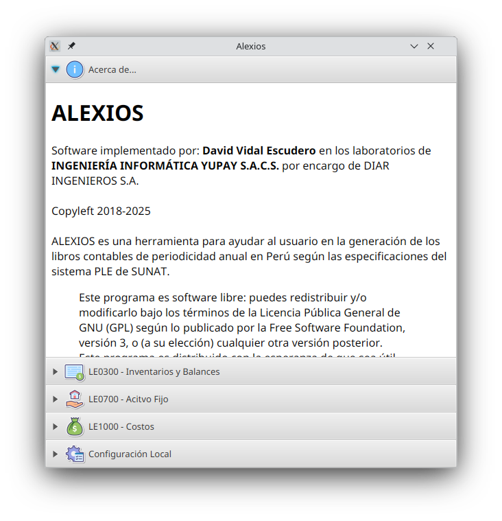
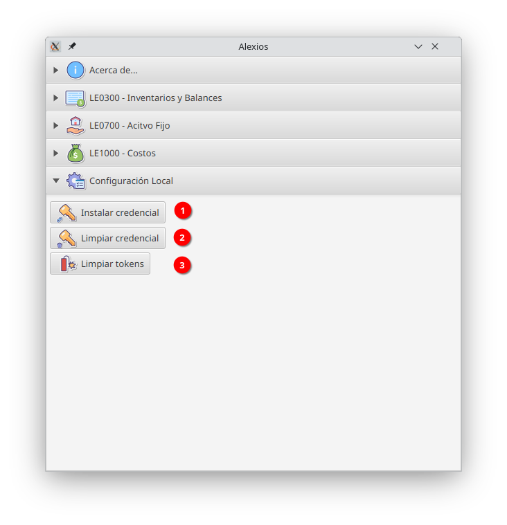
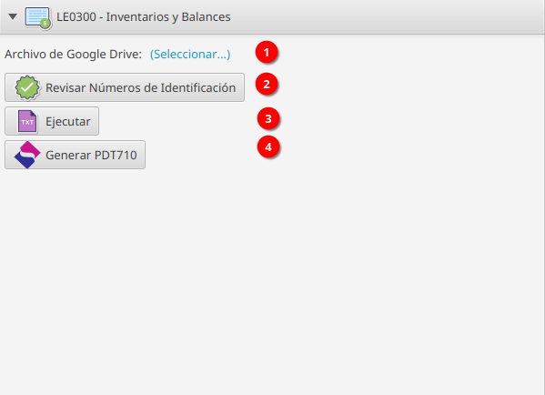

# The Alexios Project

v1.0

Copyleft 2021 - Lima Perú.

## What is Alexios?

Alexios is a helper application to generate the TXT files required by SUNAT, the peruvian taxation authority.

The user creates a Google spreadsheet containing the required information, and using Alexios may create the plain text,
pipe (|) separated format.

## What is NOT Alexios?

Alexios is NOT an ERP, nor an accounting software. Neither validates the user inputs, it only transforms data from one
human friendly format to the TXT specified by the Programa de Libros Electrónicos SUNAT (PLE - SUNAT) v5.1.

## Books implementations

The Alexios has interfaces that should be implemented. Those interfaces correspond to each book specified by PLE.

Currently, theese books are implemented:

- LE030000 -> Inventories and balances.
- LE070000 -> Assets.
- LE100000 -> Costs.

# How to use Alexios?

1. Get an Oauth ClientID credentials.json file from Google Platform Cloud, with
permissions for the scopes: ``https://www.googleapis.com/auth/spreadsheets.readonly`` 
and ``https://www.googleapis.com/auth/drive.readonly``, if you don't
know how to create a google api credential, visit [Google Cloud](https://developers.google.com/workspace/guides/create-credentials#oauth-client-id) site.
2. When opening Alexios for first time, you need to install credentials.json
in your local computer. Just, open Configuración Local panel.

## Configuración Local

This screen contains options to manage local settings.
It contains 3 buttons:
1. **Install credential:** this button shows a file selector,
you choose your credentials.json file from Google OAuth Client ID,
and it's installed in your system. If no credential is installed,
no operation can be performed.
2. **Clear credential:** If for some security reason you need to delete
the currently installed credential, just click here.
3. **Clear tokens:** If for some security reason, or any unexpected error
you need to refresh the google tokens, then you click here. You need to clean
the tokens repository when changing credentials.

# Produce your datasheets
Now, you need to work your datasheets in a google spreadsheet,
Alexios stands on some of our drafts templates specially developed
for our users. You can find a public template to copy into your own workspace
for each electronic accounting book:
- [LE0300 - Inventory and Balances](https://docs.google.com/spreadsheets/d/17RbDdM_3AElQeiNDf9Q94spKr4RnXQlX6hRfXqu14hs/edit?usp=sharing)
- [LE0700 - Fixed Assets](https://docs.google.com/spreadsheets/d/1Z1KgeRMDz-esVx6Frn3qSQHmgUbeCrOHenc1aeM_x3M/edit?usp=sharing)
- [LE1000 - Costs](https://docs.google.com/spreadsheets/d/11REGGW1qw1qJ3VbZgPkpco0rgJlpMnZn_vGKS6XyV9w/edit?usp=sharing)

# Generate your PLE-TXT files
Finally, use each panel to load the information from google worksheets and export them to txt.
Example, LE0300 - Inventory and balances:

1: Selection link. You can drag and drop the link to the google worksheet,
or right click, paste into the text field and press enter.

2: DOI check. You can check that all document of identification numbers are consistent
with the rules given for the type of document. If any inconsistency is detected, you can
see in which sheet/book and row you should fix it. For instance, in Peru a national ID card
number can only contain 8 numeric digits.

3: Execute, you will be asked for a destination folder, then all required SUNAT - PLE txt files
with the appropirate names will be generated.

4: PDT710, you will be asked for a destination folder, then all files required to import information
in the PDT710 application will be generated.

Similar workflows are implemented for Assets and Costs.